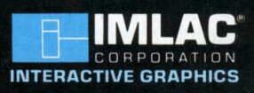

# Software for the Imlac computers

The Imlac computers were a family of 16-bit minicomputers.

## CERN

Sadly, no CERN software has been preserved.  Included are two photos
from Brian E. Carpenter.  One is of Jean-Pierre Potier, and the other
is Brian E. Carpenter.  Photo credits to CERN.

## MIT

Files from MIT's [Tapes of Tech Square
collection](https://archivesspace.mit.edu/repositories/2/resources/1265).
They are mostly from the ML and MC PDP-10 computers.

## Purdue University

[Files from Tom Uban.](http://www.ubanproductions.com/imlac_sw.html)
It's highly likely some of them are originally from MIT; for example
"ssv", "crashmit", etc.

## Stanford

## University of Washington

**Freeway**

*Filenames*: washington/freeway.pdf, washington/freeway.lst  
A game from the department of Psychology at University of Washington.

## Emulators

[Josh Dersch's sImlac emulator](https://github.com/jdersch/sImlac) has
support for the PDS-1D and PDS4, as well as most hardware options.  It
will run most software in this collection.

The `emulator` directory has configuration files for running some of
the programs in this collection.
